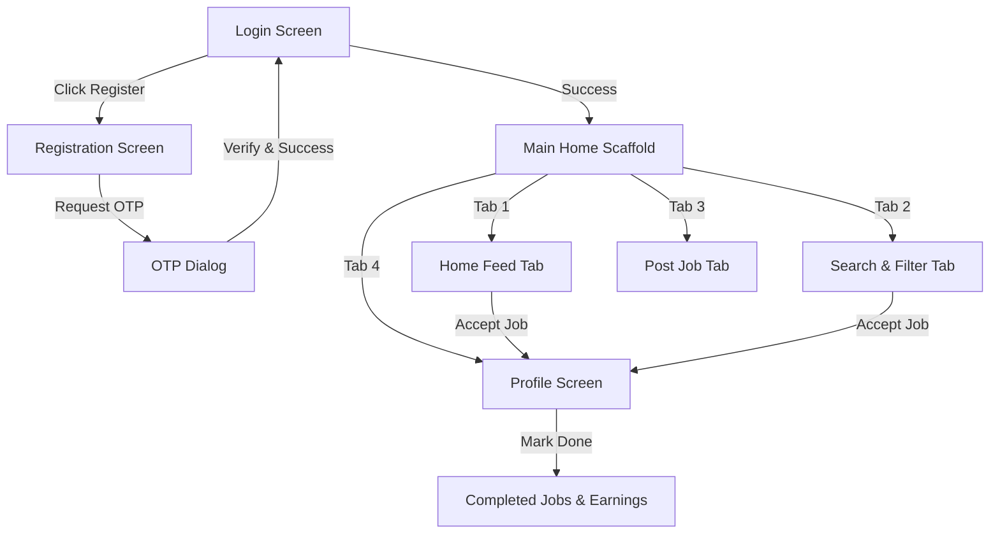

# FarmForce (WorkNear)

FarmForce (internal project name *WorkNear*) is a modern, mobile job marketplace app focused on farm labor and local hiring, built with Kotlin, Jetpack Compose, and Retrofit. The app connects local agricultural workers/farmers with landowners and employers to discover, accept, and post jobs.

This repository houses the complete project workspace, containing the Android mobile codebase, git-based modernization hooks, and backend configuration placeholders.

---

## 🏗️ Repository Structure

The workspace is organized as follows:

*   **`FarmForce/`**: The core Android application and setup.
    *   **`app/`**: Android application module containing all code, resources, and gradle build rules.
        *   `src/main/java/com/example/worknear/`: Main Kotlin application package.
            *   [`navigation/`](file:///d:/farmforce/FarmForce/app/src/main/java/com/example/worknear/navigation/): Contains [`AppNavHost.kt`](file:///d:/farmforce/FarmForce/app/src/main/java/com/example/worknear/navigation/AppNavHost.kt) and [`BottomNavGraph.kt`](file:///d:/farmforce/FarmForce/app/src/main/java/com/example/worknear/navigation/BottomNavGraph.kt) specifying route handling.
            *   [`network/`](file:///d:/farmforce/FarmForce/app/src/main/java/com/example/worknear/network/): Houses API service interfaces ([`ApiService.kt`](file:///d:/farmforce/FarmForce/app/src/main/java/com/example/worknear/network/ApiService.kt)), data classes ([`DataModels.kt`](file:///d:/farmforce/FarmForce/app/src/main/java/com/example/worknear/network/DataModels.kt)), and network client configurations ([`RetrofitInstance.kt`](file:///d:/farmforce/FarmForce/app/src/main/java/com/example/worknear/network/RetrofitInstance.kt)).
            *   [`screens/`](file:///d:/farmforce/FarmForce/app/src/main/java/com/example/worknear/screens/): Contain page-specific Composable functions (Home feed, Search filters, Post job form, and Profile views).
            *   [`ui/`](file:///d:/farmforce/FarmForce/app/src/main/java/com/example/worknear/ui/): Layout components, themes, styling parameters, and auth pages (Registration and Login screens).
    *   **`FarmForce-Backend/`**: Empty placeholder directory reserved for backend API / Node.js server source code.
*   **`.github/`**:
    *   **`modernize/java-upgrade/`**: Contains automation hooks and scripting configurations (`recordToolUse.ps1`, `recordToolUse.sh`) to support modernization workflows.

---

## 🛠️ Technology Stack & Dependencies

*   **Language**: Kotlin
*   **UI Framework**: Jetpack Compose with Material 3 styling
*   **Networking**: Retrofit 2 & OkHttp 4 for REST API interactions
*   **Serialization**: Gson converter for JSON data models
*   **Build System**: Gradle Version Catalogs (`gradle/libs.versions.toml`)
*   **Target SDK**: API 35 (Android 15)
*   **Min SDK**: API 24 (Android 7.0)
*   **Java Version Compatibility**: Java 11

---

## 🗺️ Application Flow & Architecture

The application flow spans user authentication, jobs management, and user history tracking.



### Key Functional Areas

1.  **Authentication & OTP Verification**
    *   Registration includes phone number input. The app invokes `/api/otp/send` to dispatch an OTP and presents a verification dialog that invokes `/api/otp/verify` upon submission.
    *   Once verified, the register request is finalized via `/api/register`.
    *   User authentication uses password matching over `/api/login` and persists the session locally in `SharedPreferences`.

2.  **Home Feed Discovery**
    *   Pulls current job listings from the backend server.
    *   Displays details like posted date, wage rates (₹), vacancy numbers, locations, and age limits.
    *   Enables workers to accept jobs (saved to their profile) or dismiss them from their feed.

3.  **Search & Wage Filters**
    *   Features real-time text query searching.
    *   Allows sliding wage filter boundaries (min/max wage) and exact location filters.

4.  **Job Posting Form**
    *   Allows land owners/employers to post new job vacancies with title, location, vacant positions count, wage, and age eligibility rules.

5.  **Profile Dashboard**
    *   Manages profile metadata, accepted tasks, completed tasks, and tracks total earnings accumulators dynamically from the server.

---

## 🚀 Setup & Local Execution

Follow these steps to build and run the Android app:

### 1. Requirements
*   Android Studio (Bumblebee 2021.1.1 or newer recommended)
*   Java Development Kit (JDK) 11+
*   Internet connection (to pull Gradle dependencies and talk to the hosted Render API)

### 2. Configure Backend Host
The mobile app communicates with a hosted backend server on Render:
*   URL: `https://backend-server-g4uw.onrender.com`
*   To redirect requests (e.g. to a local host), modify the URL string in [`RetrofitInstance.kt`](file:///d:/farmforce/FarmForce/app/src/main/java/com/example/worknear/network/RetrofitInstance.kt):
    ```kotlin
    private const val BASE_URL = "https://backend-server-g4uw.onrender.com" // Update as needed
    ```

### 3. Build via Command Line
Run the following inside the `FarmForce/` subdirectory:

*   **On Windows (Command Prompt/PowerShell)**:
    ```bash
    .\gradlew.bat assembleDebug
    ```
*   **On Linux/macOS**:
    ```bash
    ./gradlew assembleDebug
    ```

### 4. Deploy and Run
Open the `FarmForce/` directory inside Android Studio, sync Gradle, and run the configuration on an emulator or physically connected device.
